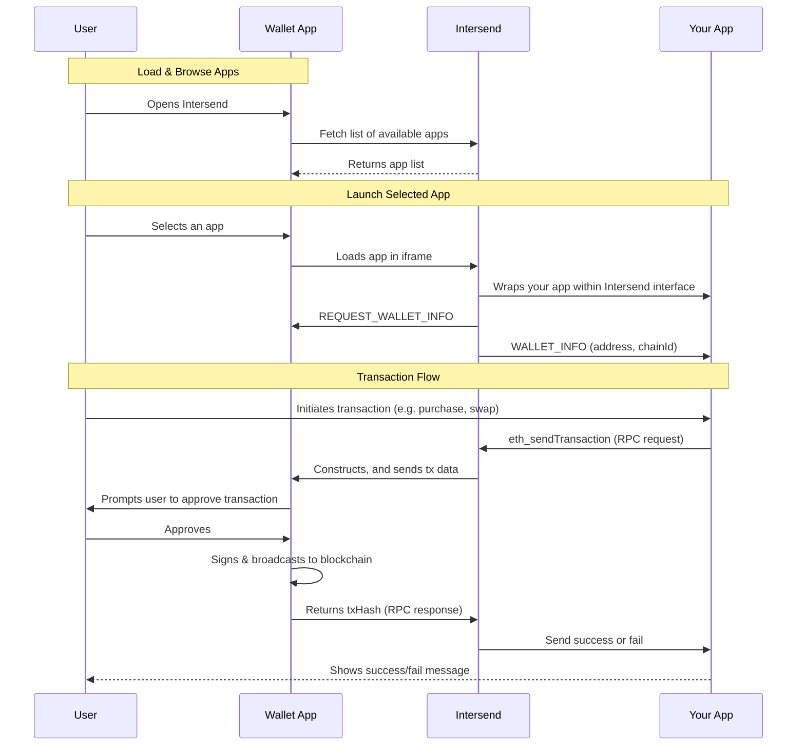

Intersend is a non-custodial app store for crypto apps that enables seamless Web3 interactions through a unified experience. The fundamental goal is: **make it simple for your app and your users to connect, sign, and transact**.

The integration enables seamless communication between your app and Intersend through:

- **Auto Connection**: Automatically connects user's wallet with your app on page load with SIWE authentication
- **Message Relay**: Handles transaction signing, message signing, and contract interactions through secure postMessage communication
- **Non-Intrusive**: Only activates when your app is accessed through Intersend, preserving your existing functionality

Below is a high-level guide for dApps that want to be listed in Intersend and auto-connect with users’ wallets via Intersend.

---

## Key Concepts

### Connectors

A “connector” is a small integration layer that allows Intersend to inject a user’s wallet/account into your dApp. We support multiple connector approaches, including:

- **Safe Connector** (common in Wagmi-powered apps)
- **Custom connectors** for:
  - [Privy](https://intersend.mintlify.app/apps/privy)
  - [Dynamic](https://intersend.mintlify.app/apps/dynamic)
- Other authentication providers are in progress (Thirdweb, web3-onboard, Magic, Web3Auth, etc.) or can be integrated similarly.

If your dApp already has a Safe Connector enabled in Wagmi, you’re effectively compatible with Intersend’s “Safe flow” right away. Otherwise, check our [Privy Guide](https://intersend.mintlify.app/apps/privy) or [Dynamic Guide](https://intersend.mintlify.app/apps/dynamic) for more specific integration steps.

### iFrame & PostMessage

Intersend loads your dApp within an iframe, using secure `postMessage` events to:

1. **Auto-connect** the user’s wallet/account
2. **Relay transactions** for user signatures
3. **Share** signed data, chain switches, and transaction confirmations back to your dApp

Because of this, you may need to **whitelist Intersend’s domain** so your site can be embedded in an iframe and to allow cross-domain communication.

## How It Works

### Get Listed Once integrated, contact us for review and approval:

- Email: hello@intersend.io
- Telegram: @erturkarda

We’ll add your project to the Intersend App Store so users can seamlessly discover and use your dApp.

