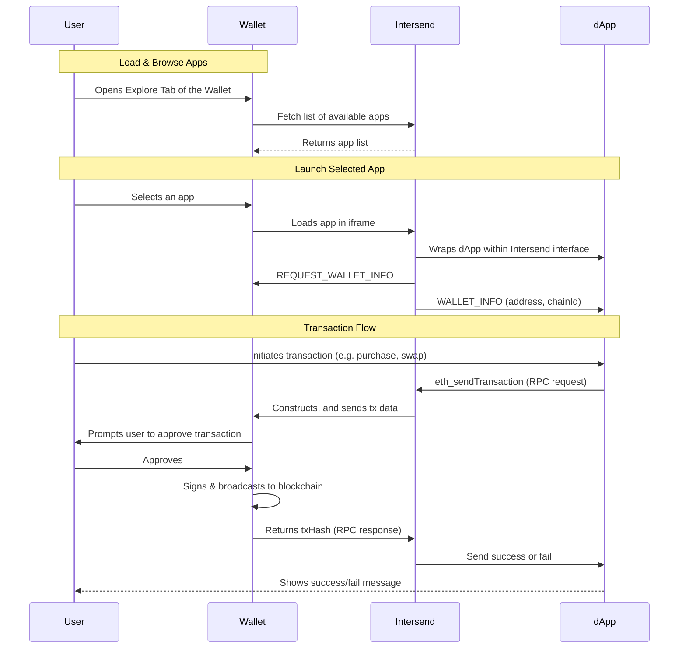

Turn every app in your ecosystem into an “embeddable app” that can run inside any wallet or Web3 interface using Intersend’s universal connector.

Intersend is a lightweight, iframe-based “app store” solution that embeds dApps into wallets (or other containers), automatically injecting the correct user account and handling all message passing for signing and transactions.

By providing the Intersend connector in your SDK, every dApp using your auth framework becomes instantly embeddable in any wallet or platform that supports Intersend.

---

## Why Integrate with Intersend?

1. **Grow Your Ecosystem**

Every app built on your SDK becomes portable. Wallets or other containers that integrate with Intersend can instantly offer those apps—no extra setup on the dApp side.

2. **Unified User Experience**

Intersend automatically handles account injection, transaction flow, and chain switching through secure postMessage. Your apps stay brand-aligned while benefiting from Intersend’s universal compatibility.

3. **Secure by Design**

No private key exposure: All signing logic remains in the user’s wallet.

4. **No Maintenance Overload**

Once the connector is set up, all dApps on your platform instantly work inside Intersend.

Wallet teams embed Intersend once; every new app from your ecosystem automatically becomes available to their users.

---

## How It Works

Below is a simplified flow describing how an app (built with your auth SDK) interacts with a user's wallet through Intersend.

## Basic Flow

1. Someone uses Intersend SDK to add "App X" into "App Y" (under the hood, an iframe loads the dApp)

2. "App X" is built with your authentication sdk.
   Your SDK automatically injects the Intersend connector into App X.

3. The wallet in "App Y" sees that your connector is present and
   passes user account + chain info via secure postMessage to the embedded app.

### End Result
- The app is fully functional, automatically connected to the user's wallet/account 
- Transactions, signatures, chain switching, etc. flow through Intersend's secure layer

## Flow Diagram

