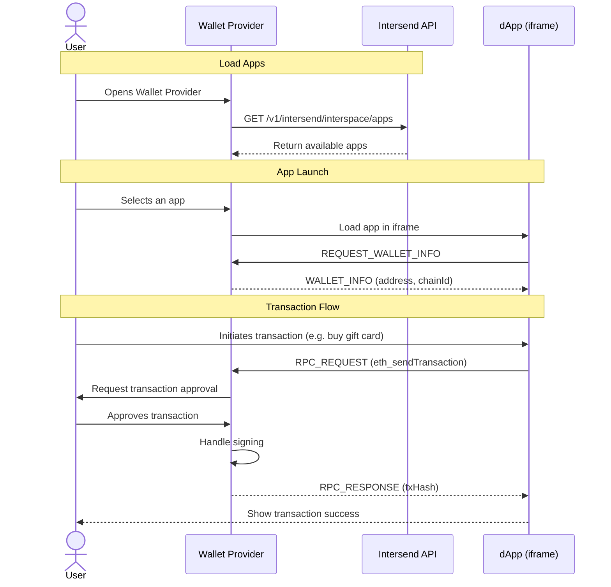

Transform your wallet into a powerful Web3 gateway without the overhead of maintaining a dApp store. Intersend enables you to effortlessly embed popular Web3 applications directly into your wallet interface, providing your users with a seamless, secure experience.

## Overview

#### Key Benefits

- **Zero Maintenance dApp Store**: New apps added to Intersend ecosystem automatically become available to your users
- **Native Experience**: Users interact with dApps directly through your wallet - no external connections needed
- **Enhanced Security**: All transactions and signatures are handled by your wallet's security infrastructure
- **Unified User Experience**: One-click access to apps with pre-injected wallet connection
- **Full Control**: Choose which apps to display and customize the integration to match your wallet's UI

### How It Works



### Security Architecture

The SDK implements a secure messaging protocol between the embedded app and your wallet:

- Apps run in isolated iframes with specific permissions
- All cryptographic operations occur within your wallet's secure environment
- Transaction requests are handled by your wallet's native signing flow
- No direct access to user's private keys or sensitive data


## Quick Integration Guide

### 1. Install the SDK
```bash
npm install universal-portability
```

### 2. Add Universal Portability Provider
Wrap your application with the UniversalPortabilityProvider. Place it within your existing providers:

```javascript
import { UniversalPortabilityProvider } from 'universal-portability';

function App() {
  return (
    <WagmiProvider config={wagmiConfig}>
      <OtherProviders>
        <UniversalPortabilityProvider>
          {/* Your app components */}
        </UniversalPortabilityProvider>
      </OtherProviders>
    </WagmiProvider>
  );
}
```

### 3. Message Handling & Transactions
Create a message handler to manage communication between your wallet and ported apps. This handler processes transaction requests and wallet interactions.

```typescript
// src/handlers/messageHandler.ts
import { sendMessageToIframe } from 'universal-portability';

export const createMessageHandler = (walletAddress: string) => {
  return async (event: MessageEvent) => {
    // Security: Validate message origin
    if (event.origin !== 'https://app.intersend.io') return;
    
    const { type, payload, id } = event.data;
    
    switch (type) {
      case 'REQUEST_WALLET_INFO':
        sendMessageToIframe({
          type: 'WALLET_INFO',
          payload: {
            address: walletAddress,
            chainId: '0x89', // Your wallet's chain
            isConnected: true
          },
          id
        });
        break;
        
      case 'RPC_REQUEST':
        if (payload.method === 'eth_sendTransaction') {
          try {
            // Your wallet's transaction handling
            const txHash = await handleWalletTransaction(payload.params[0]);
            sendMessageToIframe({
              type: 'RPC_RESPONSE',
              payload: txHash,
              id
            });
          } catch (error) {
            sendMessageToIframe({
              type: 'RPC_RESPONSE',
              error: {
                code: 4000,
                message: error.message
              },
              id
            });
          }
        }
        break;
    }
  };
};
```

### 4. Display and Port Apps into your wallet
```javascript
import { Port, usePortableApps } from 'universal-portability';
import { createMessageHandler } from '../handlers/messageHandler';

import { useEffect } from 'react';

function AppContainer({ walletAddress }) {

   // 1. Fetch apps
  const { apps } = usePortableApps(); // fetch all the apps


  // 2. Set up message handling
  useEffect(() => {
    const handler = createMessageHandler(walletAddress);
    window.addEventListener('message', handler);
    
    return () => {
      window.removeEventListener('message', handler);
    };
  }, [walletAddress]);

  // 3. Render apps with Port component
  return (
    <div>
      {apps.map(app => (
        <div key={app.id}>
          
          <h3>{app.name}</h3>
          
          <Port
            src={app.url}
            accountAddress={walletAddress}
          />
        </div>
      ))}
    </div>
  );
}
```

### Message Protocol
The SDK uses a secure postMessage protocol for communication:
- `REQUEST_WALLET_INFO`: App requests wallet connection details
- `WALLET_INFO`: Wallet responds with account information
- `RPC_REQUEST`: App requests transaction signing or other RPC methods
- `RPC_RESPONSE`: Wallet responds with transaction result

All sensitive operations (signing, approvals) are handled by your wallet's existing security infrastructure, ensuring a safe and consistent user experience.

### Contact Us

- Email: hello@intersend.io
- Telegram: @erturkarda
