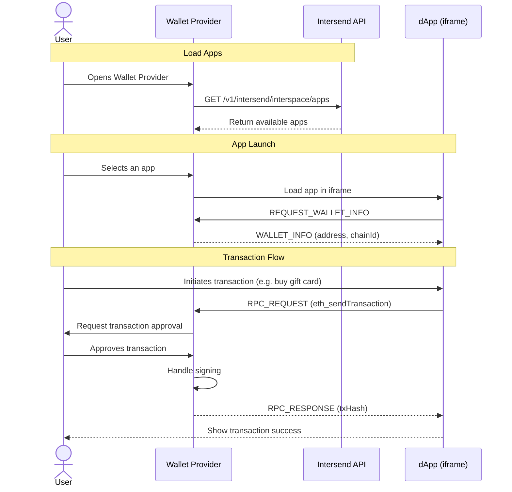

Transform your wallet into a powerful Web3 gateway without the overhead of maintaining a dApp store. Intersend enables you to effortlessly embed popular Web3 applications directly into your wallet interface, providing your users with a seamless, secure experience.

## Overview

#### Key Benefits

- **Zero Maintenance dApp Store**: New apps added to Intersend ecosystem automatically become available to your users
- **Native Experience**: Users interact with dApps directly through your wallet - no external connections needed
- **Enhanced Security**: All transactions and signatures are handled by your wallet's security infrastructure
- **Unified User Experience**: One-click access to apps with pre-injected wallet connection
- **Full Control**: Choose which apps to display and customize the integration to match your wallet's UI

### How It Works



### Security Architecture

The SDK implements a secure messaging protocol between the embedded app and your wallet:

- Apps run in isolated iframes
- All signing occurs in your wallet's secure environment
- No direct access to private keys
- Origin validation for all messages


## Quick Integration Guide

### 1. Install the SDK
```bash
npm install universal-portability
```

### 2. Set Up Provider
Wrap your application with the UniversalPortabilityProvider:

```javascript
import { UniversalPortabilityProvider } from 'universal-portability';

function App() {
  return (
    <WagmiProvider config={wagmiConfig}>
      <UniversalPortabilityProvider>
        {/* Your app */}
      </UniversalPortabilityProvider>
    </WagmiProvider>
  );
}
```

### 3. Implement Message Handlers

Create these two hooks to handle communication between your wallet and embedded dApps:

<Accordion title="src/hooks/useMessageHandler.ts">
```typescript
import { useEffect } from 'react';
import { useUniversalPortability } from 'universal-portability';
import { sendTransaction, signMessage } from '@wagmi/core';
import { config } from '../wagmi';
import { hexToString } from 'viem';

export interface MessageHandlerConfig {
  walletAddress: string;
  chainId: number;
}

export function useMessageHandler({ walletAddress, chainId }: MessageHandlerConfig) {
  const { sendMessageToIFrame } = useUniversalPortability();

  useEffect(() => {
    const handleMessage = async (event: MessageEvent) => {
      const { type, payload, requestId } = event.data;

      try {
        switch (type) {
          case 'INTERSEND_CONNECT_REQUEST':
            sendMessageToIFrame(
              {
                type: 'INTERSEND_CONNECT_RESPONSE',
                payload: {
                  address: walletAddress,
                  chainId,
                  isConnected: true,
                }
              }
            );
            break;

          case 'SIGN_MESSAGE_REQUEST':
            // Handle message signing
            break;

          case 'TRANSACTION_REQUEST':
            // Handle transaction requests
            break;
        }
      } catch (error: any) {
        // Error handling
      }
    };

    window.addEventListener('message', handleMessage);
    return () => window.removeEventListener('message', handleMessage);
  }, [walletAddress, chainId, sendMessageToIFrame]);
}
```
</Accordion>

<Accordion title="src/hooks/usePortHandler.ts">
```typescript
import { useAccount, useChainId } from 'wagmi';
import { useMessageHandler } from './useMessageHandler';

export function usePortHandler() {
  const { address } = useAccount();
  const chainId = useChainId();

  useMessageHandler({
    walletAddress: address!,
    chainId: chainId!
  });

  return {
    isReady: Boolean(address && chainId)
  };
}
```
</Accordion>

### 4. Create dApp Store Container

Display available dApps to your users:

```typescript
import { Port, usePortableApps } from 'universal-portability';

function DAppStoreContainer() {
  const { apps } = usePortableApps();

  return (
    <div className="dapp-grid">
      {apps.map(app => (
        <div key={app.id} className="dapp-card">
          
          <h3>{app.name}</h3>
          <button onClick={() => navigateToApp(app)}>
            Launch App
          </button>
        </div>
      ))}
    </div>
  );
}
```

### 5. Render dApp Interface

Create a container to load and display the selected dApp:

```typescript
import { Port } from 'universal-portability';
import { useAccount, useChainId } from 'wagmi';

import { usePortHandler } from '../hooks/usePortHandler';

function AppContainer({ app }) {
  const rpcURL = process.env.RPC_URL;
  const { address } = useAccount();

  // enable postMessage communication
  usePortHandler();

  return (
    <Port
      src={`https://app.intersend.io/apps/${app.slug}`}
      address={address}
      rpcUrl={rpcURL}
      height="400px"
      width="800px"
    />
  );
}
```

## Message Protocol

The SDK uses a secure postMessage protocol with these main events:

- `INTERSEND_CONNECT_REQUEST`: Initial wallet connection request
- `SIGN_MESSAGE_REQUEST`: Request to sign a message
- `TRANSACTION_REQUEST`: Request to send a transaction
- `*_RESPONSE`: Corresponding response events

All sensitive operations (signing, approvals) are handled by your wallet's existing security infrastructure, ensuring a safe and consistent user experience.

### Contact Us

- Email: hello@intersend.io
- Telegram: @erturkarda
