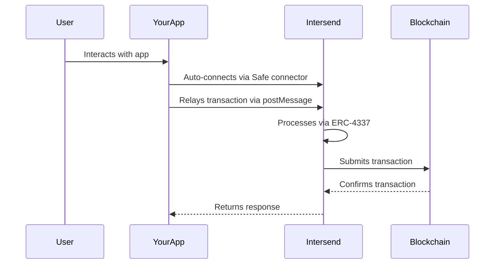

# Integrate Your App with Intersend

Intersend App Store is a non-custodial app marketplace that enables seamless Web3 interactions through unified smart accounts. This guide explains how to make your existing web app compatible with Intersend.

## Overview

When integrated, your app will automatically connect to users' Intersend smart accounts and relay transactions through our infrastructure, providing:

- Seamless transaction handling via ERC-4337
- Unified wallet experience
- Gas abstraction capabilities
- Multi-chain support

## Prerequisites

- Existing web app using wagmi
- Support for Safe connector

## Integration Steps

### 1. Add Safe Connector

Add the Safe connector to your wagmi config if not already present:

```typescript
import { createConfig, http } from 'wagmi'
import { mainnet, sepolia, polygon } from 'wagmi/chains'
import { createClient } from 'viem'
import { safe } from 'wagmi/connectors'

export const config = createConfig({
    chains: [mainnet, sepolia, polygon],
    connectors: [
      safe(), // Add Safe connector
      // ... other connectors
    ],
    client({ chain }) {
      return createClient({ chain, transport: http() })
    },
})
```

### 2. Whitelist Intersend Domain

Add Intersend domains to your authentication provider's allowed origins. This enables iframe communication between your app and Intersend.

Required domains:

- `intersend.io`
- `*.intersend.io`

Provider-specific instructions:

- **Dynamic**: Add domains in authentication settings

- **Privy**: [Configuration Guide](https://docs.privy.io/guide/react/configuration/allowed-domains)

- **Magic.link**: [Domain Allowlist](https://magic.link/docs/authentication/security/allowlists/domain-allowlist#usage)

## How It Works



1. User interacts with your app within Intersend
2. Safe connector automatically connects to user's smart account
3. Transaction requests are relayed to Intersend via postMessage
4. Intersend processes transactions using ERC-4337
5. Responses are sent back to your app

### Get Listed Once integrated, contact us for review and approval:

- Email: hello@intersend.io
- Telegram: @erturkarda

We'll review your integration and add your app to the Intersend App Store.
