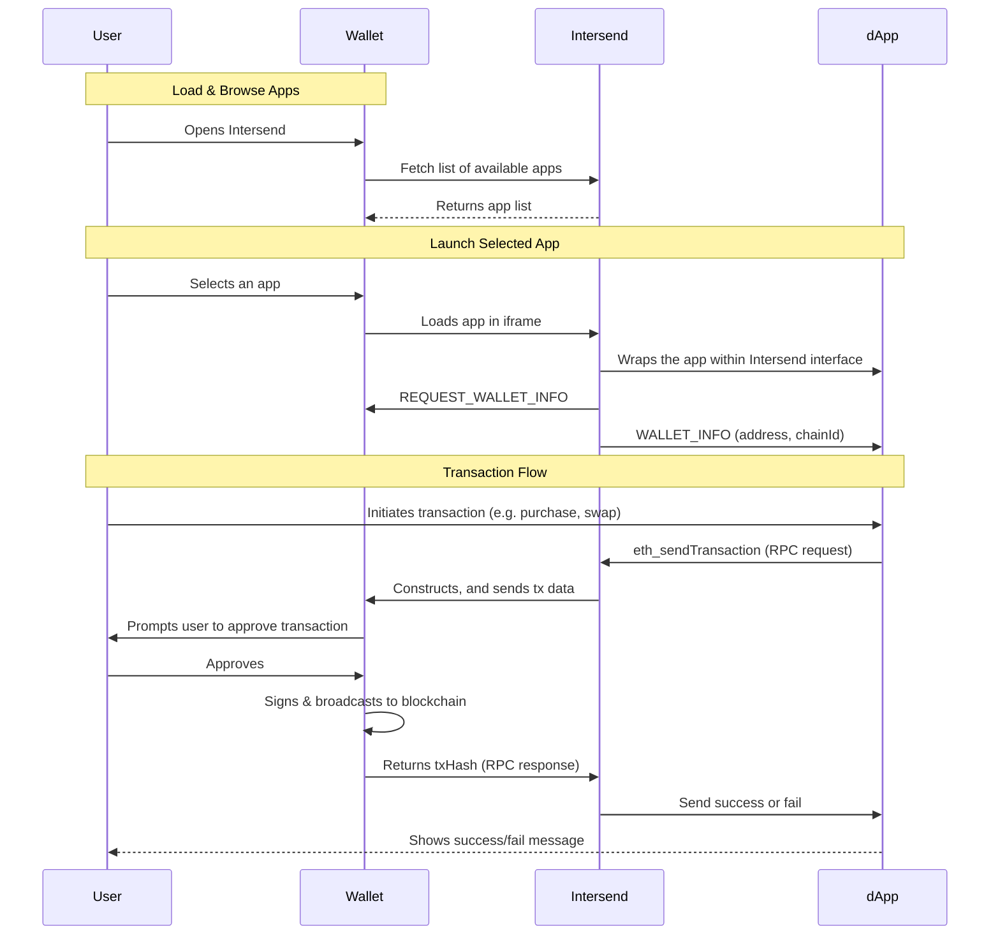

<Tip>
  See our Intersend integrated example wallet demo:

  <iframe
  width="560"
  height="315"
  src="https://www.youtube.com/embed/lNm-WVD2JlY?si=jQkCCMyR38xQ_JWq"
  title="YouTube video player"
  frameborder="0"
  allow="accelerometer; autoplay; clipboard-write; encrypted-media; gyroscope; picture-in-picture"
  allowfullscreen
></iframe>

</Tip>

Transform your wallet into a powerful Web3 gateway without the overhead of maintaining a separate dApp store. **Intersend** enables you to embed popular Web3 applications directly into your wallet interface, providing your users with a seamless, secure experience that’s driven by a universal “connector” layer.

## Overview

#### Key Benefits

- **Zero Maintenance dApp Store**  
  New apps added to the Intersend ecosystem automatically become available to your users—no extra dev work for you.

- **Enhanced Security**  
  All transactions and signatures are handled by your wallet’s own security infrastructure. Private keys stay private.

- **Unified User Experience**  
  Auto-injected wallet connection ensures “one-click” access to dApps. No extra sign-ins or account creation.

- **Customizable Integration**  
  You decide which dApps to display and how they appear in your wallet. Control the look and feel.

---

### How It Works

Under the hood, Intersend provides an iframe-based connector that mediates communication between your wallet and apps available on Intersend. Your wallet remains in control of signing, transaction approvals, and chain selection, while Intersend relays messages securely via `postMessage`.

---

### Security Architecture

The SDK implements a secure messaging protocol between the embedded app and your wallet:

- Isolated Iframes:
All third-party dApps are sandboxed within an iframe managed by Intersend. This prevents unauthorized access to your code or your users’ private keys.

- No Private Key Exposure:
Any signature or transaction request is forwarded to your wallet’s internal signing logic. Keys never leave your environment.

- Origin Validation:
The Intersend SDK verifies the origin of incoming messages. Suspicious or unknown sources are ignored.

### Contact Us

- Email: hello@intersend.io
- Telegram: @erturkarda
